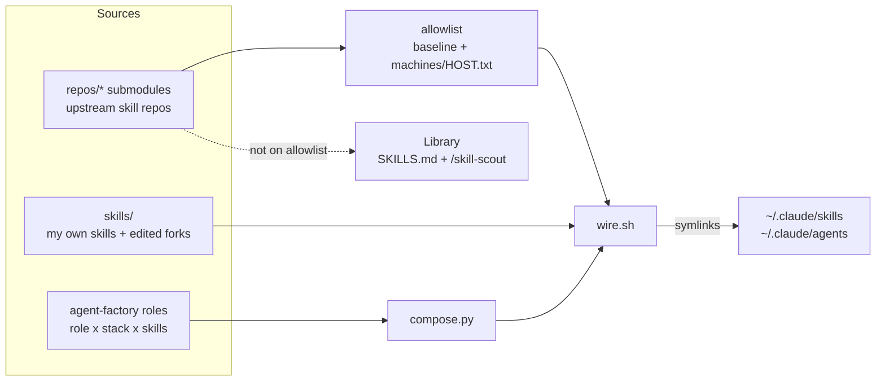

## Context

- Source review: landing-review.md (2026-10-09). Scorecard for the-grid: hook 2/1, proof 1, audience 1, About/SEO 1, CTAs 1.
- Facts checked against the repo today:
  - `README.md` is 410 lines; ~70% is maintainer material. The clone URL is `https://github.com/<your-username>/the-grid.git`.
  - `index.html` is 2000 lines, `<h1 class="hero-wordmark">` is visually hidden, the hero is `the-grid.png` (5.6 MB, 2816x1536), there are no links to the repo, only `<title>`, and counts are hand-typed (`137`, `~1,275`) and already disagree with `SKILLS.md` (library = 102).
  - `/tron` is an agent-factory orchestrator, so it is only wired by `bootstrap.sh --with-agents` (needs `python3`). The review's quickstart (plain bootstrap, then `/tron`) would fail. The quickstart below uses `--with-agents`.
  - `bootstrap.sh` ends with "Bootstrap complete. Open a fresh Claude session to pick up new skills/agents."
  - `catalog.sh` already prints total / wired / root-owned / upstream-wired / library in the committed `SKILLS.md` headline (`**239 skills indexed** — 137 wired live (14 root-owned + 123 from allowlisted repos), 102 in library ...`). Roles = 38 = `- role:` lines across `agent-factory/examples/*.yaml` (5+6+3+24).
  - `the-grid.png` stays in the repo after `depersonalise` (allowlisted in `scripts/personal-allow-paths.txt` until this change replaces it). `depersonalise` removes `prompts/2026-06-13-openclaw-lamp-team-prompt.md` to the private archive, which retires #7.
  - `depersonalise`'s size scan blocks tracked files over 1 MB unless allowlisted. Pages is deployed by a GitHub Actions workflow from `main` that publishes only the files listed in the tracked `site-files.txt` (`foundations`, Q9 default; `.nojekyll` kept as belt-and-braces); this change appends its site files to that list. `manifest-lock-install` adds `grid install` and documents it in BOOTSTRAP.md.
  - `gate.sh` runs shellcheck, catalog, compose, bats. CI runs only bats.
- Operator decisions (taken as fixed): the hero sentence, keep Tron reference + Flynn quote + ASCII art, "Who it's for" high, mermaid diagram, first-person author voice, README-only translations into 9 locales, no "why not ECC/gstack" section.
- Voice: first person ("I"), one byline "Gareth Knight" in the README footer and the site footer. `depersonalise` allows the name in prose docs; the author speaks as "I", never third person.

## Approach

Seven slices, in dependency order:

1. **Counts** become data: `scripts/stamp-counts.py` reads the committed `SKILLS.md` headline and rewrites marker comments in README*, index.html; `catalog.sh` restamps after regenerating; gate fails on drift. Everything after this uses markers instead of typed numbers.
2. **Doc split** lands before the README shrinks, so no content is lost: INSTALL, CONTRIBUTING, docs/architecture, docs/roadmap, docs/private-projects.
3. **README** rewritten against a fixed skeleton (below).
4. **Site assets** script + HUMAN render, then **index.html** rebuilt on those assets.
5. **Translations** pipeline (script, staleness check), generated only after HUMAN copy sign-off.
6. **Demo tape** + **repo-metadata script**, rendered/applied by HUMAN.
7. **Tag v0.1.0** by HUMAN last.

### README skeleton (target 150-180 lines, hard test bounds 140-185)

Order is fixed; the test asserts the `##` headings appear in this order.

| # | Block | Lines | Notes |
|---|---|---|---|
| 1 | `# the-grid`, hero sentence (bold, not a blockquote), badges, status one-liner, `<!-- langs -->` line | ~10 | |
| 2 | ASCII banner (code fence, from `the-grid.txt` content) | 9 | kept verbatim |
| 3 | `## Who it's for` | ~12 | 3 yes-bullets, 1 not-for bullet |
| 4 | `## Quickstart` | ~30 | clone+bootstrap, verify, paste-into-Claude variant |
| 5 | `## What you get` | ~14 | outcomes first, one count line via markers |
| 6 | `## How it works` | ~30 | mermaid + 4 bullets |
| 7 | `## Why "the grid"` | ~14 | Flynn monologue (9 lines) + attribution + 1 sentence on the name |
| 8 | `## Status` | ~12 | candid, kept from today's section |
| 9 | `## Docs` | ~12 | link list |
| 10 | `## Credits and license` | ~8 | wires-from line, MIT, byline |

Draft copy (implementer uses as written; HUMAN edits at sign-off):

- Hero (exact, verbatim, one paragraph, bold):
  `Inspired by Tron. Dotfiles for your AI assistant: curated skills and agent teams, wired identically onto every machine and every AI tool you use.`
- Status one-liner under badges: `Works today with Claude Code. Other AI tools: see [docs/roadmap.md](docs/roadmap.md).` (true whether or not `multi-harness` has shipped).
- Who it's for:
  - `You use more than one machine (laptop, server, work, home) and your Claude Code setup keeps drifting between them.`
  - `You collect skills from many repos and installing everything buries your session. You want a short live list and a searchable shelf.`
  - `You build agent teams (tech lead, QA, security reviewer) and want each role defined once and wired the same everywhere.`
  - `Not for you if you want a supported product, a GUI or a one-click installer. I built this for my own machines and share it because the mechanics are reusable.`
- What you get (outcomes, counts via markers):
  - `<!--count:wired-->N<!--/count--> curated skills as slash commands (/standup, /review, /ship, /skill-scout). <!--count:library-->N<!--/count--> more sit on a searchable shelf, switched off.`
  - `<!--count:roles-->N<!--/count--> ready-made agent roles: a dev team, a finance desk, a Socratic tutor (/morpheus), and /tron, which tells you which one to use.`
  - `One git pull plus wire.sh makes every machine identical; a per-machine overlay handles the differences.`
  - `Project templates with specs and agents already wired in.`
- Quickstart block (the exact command; also the install string on the site):

  ```bash
  git clone https://github.com/oneafrikan/the-grid.git ~/.the-grid && bash ~/.the-grid/scripts/bootstrap.sh --with-agents
  ```

  - Prerequisites line: `Needs git, bash, python3 (for the agent teams) and Claude Code. Node >= 20.19 only if you use the openspec-* skills (see INSTALL.md).`
  - "You should now see":
    - `bootstrap.sh` ends with `==> Bootstrap complete. Open a fresh Claude session to pick up new skills/agents.`
    - `ls ~/.claude/skills | wc -l` prints a number near `<!--count:wired-->N<!--/count-->` (plus the orchestrator skills; duplicate skill names across repos collapse to one link, so it is not exact), and `ls ~/.claude/skills/tron` lists a `SKILL.md`.
    - In a new Claude Code session `/tron` replies with a short question about what you want to do.
  - `Fork first if you plan to customise: the clone URL above is read-only for you.`
  - Paste-into-Claude variant (blockquote): `Clone https://github.com/oneafrikan/the-grid.git to ~/.the-grid, run bash ~/.the-grid/scripts/bootstrap.sh --with-agents, tell me what it printed, then tell me to open a fresh session and run /tron.`
  - Closing line: `Stop there. If it felt useful, read [USAGE.md](USAGE.md).`
- Credits line: `Wires skills from upstream projects, listed with licences in [docs/SOURCES.md](docs/SOURCES.md).` (no named "vs" comparison).
- Byline: `Built by [Gareth Knight](https://github.com/oneafrikan). MIT licensed.`

Mermaid (README `## How it works`, copied verbatim):



The four bullets under it: wired vs library; per-machine overlay; symlinks not copies (an edited root skill overrides the upstream copy); agents compiled from one source.

### Doc split map (README sections -> new home, content moved not rewritten)

| Today's README section | New home |
|---|---|
| Getting started (manual steps), openspec CLI note, Reconciling | `INSTALL.md` |
| Factories table, Repo layout, How wire.sh works | `docs/architecture.md` |
| Adding a skill, Adding a submodule, Running tests, Checking grid health | `CONTRIBUTING.md` |
| Private projects (with the overwrite warning) | `docs/private-projects.md` |
| Roadmap table + model routing note | `docs/roadmap.md` |
| Spec-driven development | 3-line pointer in README Docs, rest to `CONTRIBUTING.md` |
| Daily usage / help-skill table | already covered by USAGE.md; one row (`/tron`) stays in Quickstart |

`BOOTSTRAP.md` stays the full boot reference (it already has update, precedence, troubleshooting). `INSTALL.md` is the short outsider guide and links to it; no content is duplicated.

### Generated counts

No new data file. The source of truth is the committed `SKILLS.md` headline, which `catalog.sh` already writes and `catalog.sh --check` already guards.

- Keys (six): `indexed`, `wired`, `root_owned`, `upstream_wired`, `library` from the headline; `roles` = count of `^[[:space:]]*- role:` lines in `agent-factory/examples/*.yaml`.
- Headline regex (Python): `^\*\*(\d+) skills indexed\*\* — (\d+) wired live \((\d+) root-owned \+ (\d+) from allowlisted repos\), (\d+) in library` → indexed, wired, root_owned, upstream_wired, library.
- Marker: `<!--count:NAME-->VALUE<!--/count-->`, valid inline in Markdown and HTML. `NAME` must be one of the six keys.
- `scripts/stamp-counts.py` (python3 stdlib, honours `GRID_DIR`): rewrites VALUE in `README.md`, `README.*.md`, `index.html`; `--check` exits 1 and names the file on drift; exits 2 on an unknown NAME, or on a missing/unparsable headline when any marker exists; exits 0 when no file has markers. Idempotent.
- `catalog.sh` runs `stamp-counts.py` after writing the default `SKILLS.md` (not in `--check`, not with an output-path argument), so `wire.sh` keeps the counts current with no extra step.
- `gate.sh` gains a `counts` check (`python3 scripts/stamp-counts.py --check`), machine-independent because it compares committed files.

### index.html contract

- Keep one self-contained file (inline CSS, no web fonts, no CDN). New files: `assets/hero.webp`, `assets/og.jpg`, `assets/favicon.svg`, `assets/favicon-48.png`, `assets/apple-touch-icon.png`. The page is dark-only (`<meta name="color-scheme" content="dark">`).
- Head:
  - `<title>the-grid: Claude Code skills and agents on every machine</title>` (Q5 default; `og:title` is the same string)
  - `<meta name="description" content="Curated Claude Code skills and agent teams, wired identically onto every machine from one git repo. Free, MIT.">` (<= 160 chars; `og:description` is the same string)
  - `<link rel="canonical" href="https://oneafrikan.github.io/the-grid/">`
  - Icons, in this order: `<link rel="icon" type="image/svg+xml" href="assets/favicon.svg">`, `<link rel="icon" type="image/png" sizes="48x48" href="assets/favicon-48.png">`, `<link rel="apple-touch-icon" href="assets/apple-touch-icon.png">`; plus `<meta name="theme-color" content="#0d0d0f">` and `<meta name="color-scheme" content="dark">`.
  - Open Graph: `og:type=website`, `og:site_name`, `og:title`, `og:description`, `og:url`, `og:image` (absolute URL to `assets/og.jpg`), `og:image:type=image/jpeg`, `og:image:width=1200`, `og:image:height=630` (must equal the real pixel size of the file), `og:image:alt`. `canonical`, `og:url` and the JSON-LD `url` are the same string.
  - Twitter: `twitter:card=summary_large_image` and `twitter:image:alt` only; X falls back to the og tags for the rest.
  - JSON-LD `SoftwareSourceCode`:

    ```json
    {
      "@context": "https://schema.org",
      "@type": "SoftwareSourceCode",
      "name": "the-grid",
      "description": "Curated Claude Code skills and agent teams, wired identically onto every machine from one git repo. Free, MIT.",
      "codeRepository": "https://github.com/oneafrikan/the-grid",
      "url": "https://oneafrikan.github.io/the-grid/",
      "license": "https://opensource.org/licenses/MIT",
      "programmingLanguage": ["Shell", "Python"],
      "author": { "@type": "Person", "name": "Gareth Knight", "url": "https://github.com/oneafrikan" }
    }
    ```
- Body order: hero -> Who it's for -> Quickstart -> Flynn pull-quote band -> What you get -> How it works (inline SVG mirroring the mermaid nodes) -> Agents -> Skills summary -> Specs -> Roadmap -> Status -> Footer.
- Hero, in DOM order: a visible `<h1>` containing the hero sentence verbatim; `<pre><code id="install-cmd">` with the quickstart command (`user-select: all`) and a Copy button beside it (inline JS using `navigator.clipboard`, inside try/catch; `visibility:hidden` until JS runs, then `visible`, so no layout shift); two links styled as buttons, "View on GitHub" and "Star on GitHub" (both `https://github.com/oneafrikan/the-grid`), plus a "Quickstart" anchor; then a single `` (no `<picture>`: one WebP source, nothing to switch). `.hero { min-height: 0 }`: the old `clamp(560px, 92vh, 860px)` rule (~line 308) and the 480px `85vh` rule (~line 427) are deleted so the install command is above the fold on a phone.
- Links from the page to repo documents are absolute `https://github.com/oneafrikan/the-grid/blob/main/<path>` URLs, because Pages serves `.md` as a download, not rendered; `assets/` links stay relative.
- Title and meta name Claude Code (Q5 default). If the operator rejects Q5, the tool-neutral fallback is title `the-grid: dotfiles for your AI assistant` and description `Dotfiles for your AI assistant: curated skills and agent teams, wired identically onto every machine. Free, MIT, Claude Code today.`; `<title>`, `og:title`, meta description, `og:description` and the JSON-LD description change together. The H1 and README hero are unaffected either way (the byte-identical test covers only the hero sentence and install command).
- Site file list (Q9): every file the page needs at runtime (`index.html`, `assets/hero.webp`, `assets/og.jpg`, `assets/favicon.svg`, `assets/favicon-48.png`, `assets/apple-touch-icon.png`, and the Search Console `google<token>.html`) is a line in `site-files.txt`; the Pages workflow publishes nothing else, so `.md` files and `repos/` are not served. A bats test fails if a relative `src`/`href` in `index.html` is missing from `site-files.txt` or names a file that does not exist.
- Removed: "Key files", "Common commands", the per-repo Skills listing (replaced by one paragraph with markers and a link to SKILLS.md; it was a hand-synced copy of a generated file). The Agents cards, factories, Specs, Roadmap, Status sections are kept; typed numbers become markers.
- Fixed drift: Status bullet "partly personal ... open work, not done" replaced by README wording (personal config is gitignored). Footer: `Built by Gareth Knight. MIT. GitHub. Issues.` with links.
- Copy source of truth is README; the test asserts the hero sentence and install command are byte-identical in README, index.html (H1 and `#install-cmd`).

### Assets script

`scripts/build-site-assets.sh <source.png> [outdir=assets]` needs ImageMagick (`magick`, or `convert` on v6) with WebP support (`brew install imagemagick`, `apt install imagemagick`, `pacman -S imagemagick`); exits 3 with that message if absent. Outputs:

- `hero.webp`: resize to 1600 wide, `-quality 80 -define webp:method=6`; step quality down by 5 until < 300 KB (floor 70), exit 4 if still too large.
- `og.jpg`: 1200x630 cover-crop, centre gravity, `-quality 82`, strip metadata, must be < 250 KB.
- `favicon.svg` is not generated; it is a committed hand-written SVG (a simple grid glyph in the page accent colour). `favicon-48.png` (48x48) and `apple-touch-icon.png` (180x180) are rendered from it by the HUMAN task (commands in tasks.md 6.2) and committed; not produced by the script, because SVG rasterising depends on an optional ImageMagick delegate.
- Strips metadata; output is deterministic for a given source and ImageMagick version.

### Translations

- Locales (file `scripts/lib/readme-locales.txt`, tab-separated, order = switcher order): `zh-CN 简体中文`, `ja 日本語`, `es Español`, `pt-BR Português (Brasil)`, `de Deutsch`, `fr Français`, `it Italiano`, `ko 한국어`, `ru Русский`.
- Files: `README.<locale>.md` at the repo root.
- Header of each translation (written by the script, not the model):

  ```
  <!-- machine-translated from README.md; source-sha256=<64 hex>; locale=ja; do not edit by hand -->
  <!-- langs -->[English](README.md) · **日本語** · [简体中文](README.zh-CN.md) ...<!-- /langs -->

  > Machine-translated from the [English README](README.md). The English version is authoritative.
  ```
- Switcher line lives between `<!-- langs -->` and `<!-- /langs -->` in README.md and every translation; lists only locales whose file exists; the current language is bold; `translate-readme.sh --switcher-only` rewrites all of them deterministically with no model call.
- Source hash = sha256 of README.md after (a) removing the `<!-- langs -->...<!-- /langs -->` block and (b) replacing every count-marker value with nothing (`<!--count:wired--><!--/count-->`). So adding a skill (count change) or adding a locale never marks translations stale; only prose edits do. Hash helper: `scripts/lib/readme-hash.sh` (uses `shasum -a 256` or `sha256sum`, whichever exists).
- Generation: `scripts/translate-readme.sh [--all | --locale L ...] [--dry-run]`. One model call per locale via `"${GRID_CLAUDE:-claude}" -p --model sonnet --max-budget-usd 1 --no-session-persistence --tools "" --disable-slash-commands "$prompt"` (every flag checked against `claude --help` 2.1.295; `--max-turns` is not listed there, so it is not used: with no tools a call is one turn) with the prompt from `docs/translation-prompt.md` and the normalised English README on stdin. Arguments are passed as an array (no word-splitting, so the empty `--tools ""` argument survives); tests use the `claude` stub from `make_stubs` (loops#1) or set `GRID_CLAUDE` to it. Estimated cost for all 9: roughly 30-40k input and 40-50k output tokens, once per README change; therefore opt-in only, never in gate or hooks.
- Output validation before writing (atomic: temp file then `mv`; on failure keep the old file, exit 1): same number of ``` fences as the source; every `<!--count:` marker preserved; every relative link target in the source appears in the output; no leading chatter before the first `# `.
- Translation rules (in `docs/translation-prompt.md`): translate prose only; leave code blocks, commands, file paths, slash commands, identifiers, mermaid labels, the ASCII banner and the Flynn quote (English, with attribution) untouched; keep link targets; keep the `README.md` first-person voice; do not add or remove sections.
- `scripts/check-translations.sh [--strict]`: for each locale file that exists, compare `source-sha256` with the current hash; print `STALE <locale>` and exit 1 if any existing file is stale; `--strict` additionally exits 1 for a missing locale file. Missing files are otherwise ignored.
- Gate: runs `check-translations.sh` without `--strict`, prints a WARN list, never fails the gate.

### Demo tape

`docs/demo/demo.tape` (charmbracelet vhs). Records on a clean machine/OS user with Claude Code logged in (`claude` auth is per-user, so a throwaway `$HOME` cannot work). The clone happens in a `Hide` block (it takes minutes), then the visible part re-runs the idempotent bootstrap:

```
Output docs/demo/bootstrap-to-tron.gif
Require git
Require claude
Set Shell "bash"
Set FontSize 16
Set Width 1200
Set Height 675
Set TypingSpeed 40ms
Set Theme "Dracula"
Hide
Type "git clone https://github.com/oneafrikan/the-grid.git ~/.the-grid && bash ~/.the-grid/scripts/bootstrap.sh --with-agents > /dev/null && clear" Enter
Wait+Screen@15m /\$ $/
Show
Type "bash ~/.the-grid/scripts/bootstrap.sh --with-agents" Enter
Wait@120s /Bootstrap complete/
Sleep 1s
Type "ls ~/.claude/skills | wc -l" Enter
Sleep 2s
Type "claude" Enter
Sleep 4s
Type "/tron" Enter
Sleep 8s
```

(Exact `Wait` regex tuning is the human's during the render task; the committed tape must keep: Output .gif, both `Require`s, the `--with-agents` bootstrap line, `/tron`, no absolute user paths, and visible `Sleep` total <= 20 s.) Without an explicit timeout `Wait` gives up after 15 s, hence the `@` timeouts above. Home-directory trust prompt: `claude` asks once whether to trust the folder, so the HUMAN accepts it before recording. The README caption says the demo starts after the clone.

### Repo metadata

`scripts/repo-metadata.sh [--check|--apply]` (default `--check`): reads desired values from constants at the top of the script, compares with `gh repo view --json description,homepageUrl,repositoryTopics`, prints a diff, exits 1 on drift. `--apply` runs `gh repo edit` (description, homepage, `--add-topic` for missing, `--remove-topic` for extras). Repo = `${GRID_REPO:-<owner/name parsed from git remote origin>}`. Tests put a stub `gh` first on PATH.

- Description: `Dotfiles for your AI assistant: curated skills and agent teams, wired identically onto every machine. Claude Code today, more AI tools next.`
- Homepage: `https://oneafrikan.github.io/the-grid/`
- Topics (9): `claude-code`, `claude-skills`, `claude-code-skills`, `agent-skills`, `ai-agents`, `dotfiles`, `subagents`, `skills-manager`, `developer-tools`.
- Parsing: `gh repo view` returns `"repositoryTopics": null` for a repo with no topics (checked against `oneafrikan/the-grid`, gh 2.95.0). The script parses with `python3 -I` and accepts null, a list of `{"name"}` or a list of `{"topic":{"name"}}`; the populated shape could not be observed, so the HUMAN reads the first `--check` diff before `--apply`.

## Decisions

- Decided: author voice is first person ("I") in README and site; one byline naming Gareth Knight in README footer and site footer; the name is already public in LICENSE.
- Decided: README is the copy source of truth; index.html mirrors it; a test enforces byte-identical hero sentence and install command.
- Decided: the quickstart command uses `--with-agents`, because `/tron` is an agent-factory orchestrator that plain bootstrap does not wire; this also fixes the review's broken step 1.
- Decided: the README makes no "60 seconds" or timing claim until a HUMAN times it on a clean machine; the first run fetches ~36 submodules and is probably slower.
- Decided: keep Tron elements as follows: ASCII banner directly under the hero block (it is the wordmark), Flynn monologue in its own `## Why "the grid"` section after How it works, not collapsed. On the site, the monologue becomes a pull-quote band after Quickstart. Reason: prominent, but after the message.
- Decided: no named-competitor section, no "vs" table, no ECC/gstack in hero or in any heading; the Credits line points at `docs/SOURCES.md` and names no project.
- Decided: add INSTALL.md as a short outsider guide and keep BOOTSTRAP.md as the full reference; reason: BOOTSTRAP already holds update/precedence/troubleshooting, so duplicating it into INSTALL would drift.
- Decided: nothing is deleted in the doc split; text moves verbatim and only paths/URLs are corrected, so reviewers can diff by section.
- Decided: counts come from the committed `SKILLS.md` headline, not a new `docs/stats.json`; reason: SKILLS.md is already generated, committed and drift-checked, so a second data file would only duplicate it. `stamp-counts.py` is Python stdlib (regex), not bash, because it edits HTML/Markdown in place across several files.
- Decided: if the SKILLS.md headline format changes, `stamp-counts.py` exits 2 and a test against the real SKILLS.md fails; the headline format is the contract.
- Decided: marker form `<!--count:NAME-->VALUE<!--/count-->`; reason: invisible in both Markdown and HTML renderers, greppable, safe to repeat.
- Decided: the hero image is a WebP under 300 KB; the OG image is a JPEG, because several social crawlers still reject WebP.
- Decided: one 1200x630 `assets/og.jpg` serves both og:image and the GitHub social preview upload; reason: GitHub accepts it and a second 1280x640 file is another asset to keep in sync.
- Decided: ImageMagick is the single image dependency for `build-site-assets.sh`; the real render is HUMAN on macOS, and the script's bats test skips when ImageMagick is absent.
- Decided: the HUMAN render reads `the-grid.png` from the repo, copies it to the private repo, and group 7 then `git rm`s it and drops its `personal-allow-paths.txt` line; the script takes the source path as an argument so later re-renders use the private copy.
- Decided: no GitHub star-button widget or third-party script; "Star on GitHub" is a plain link to the repo. Reason: no network requests, no tracking.
- Decided: the architecture diagram on the site is a hand-authored inline SVG with the same nodes as the mermaid source; reason: Pages cannot render mermaid without a CDN script. Both are listed in `docs/architecture.md` as needing joint edits.
- Decided: remove "Key files", "Common commands" and the per-repo Skills listing from index.html; reason: reference material belongs in README docs/CONTRIBUTING and SKILLS.md is the generated catalogue.
- Decided: translations are generated by script via one `claude -p --model sonnet` call per locale, opt-in, never from gate or hooks; reason: token cost is a design constraint.
- Decided: translation staleness is a gate WARN, never a gate FAIL; `--strict` is used only by the release task. Reason: an unattended loop must not be blocked by every README edit.
- Decided: staleness hash ignores the switcher block and count values; reason: skill counts change constantly and are stamped into translations by `stamp-counts.py`.
- Decided: the Flynn quote stays in English in every translation; reason: it is a quotation with attribution.
- Decided: the switcher lists only existing translation files, so there are never dead links before the HUMAN generation task runs.
- Decided: Discussions stay off; CONTRIBUTING says "issues only". Reason: no capacity to moderate a second channel.
- Decided: SECURITY.md reports through GitHub private vulnerability reporting (HUMAN enables it); no email address in the repo.
- Decided: SECURITY.md promises "best-effort acknowledgement within 7 days", no bounty, supported = latest tag and `main`.
- Decided: CONTRIBUTING.md says to branch from and open PRs against `next` (the integration branch) and that nothing reaches `main` unreviewed. Reason: matches the current workflow; revisit if `next` is retired.
- Decided: CHANGELOG.md is Keep-a-Changelog style with `## [Unreleased]` and a `## [0.1.0]` entry added in the tag task.
- Decided: topics applied now are the 9 listed; `codex`, `gemini-cli` and `opencode` are added by a later edit only after `multi-harness#9` (HUMAN smoke test) passes for that harness. Reason: topics are a claim about what the repo does; today only Claude Code works.
- Decided: the GitHub About text is the hero sentence minus "Inspired by Tron" plus an honest suffix ("Claude Code today, more AI tools next"); reason: About is shown standalone and must not overclaim.
- Decided: `scripts/repo-metadata.sh` is the only way metadata is applied, so the HUMAN task is one reviewed command and reproducible later.
- Decided: tag `v0.1.0` is annotated, created by HUMAN on `main` after `next` is merged, with `gh release create v0.1.0 --notes-from-tag`; README Status wording changes from "No versioning" to "Versioned from v0.1.0; v0.x may still break between tags".
- Decided: the LAMP build prompt (#7) is retired by `depersonalise` (moved to the private archive); this change only closes #7 with a comment in the HUMAN sign-off. Reason: the file is already gone when this change lands.
- Decided: demo recording is HUMAN (needs a real terminal and Claude auth); the tape lives in the repo so it is re-renderable; the GIF is referenced from README.md only after it exists (index.html gets a text link, no embedded image: it would be ~3 MB of page weight above a 450 KB budget), and must be <= 3 MB.
- Decided: demo tape hides the initial clone and shows the idempotent bootstrap re-run, with a README caption saying so; reason: the real clone takes minutes and would blow the 20 s budget.
- Decided: Pages publishes only the files in `site-files.txt` via the `foundations` Actions workflow (Q9 default); this change appends its `assets/*` files (group 5 for `favicon.svg`, group 6 for the rendered assets) and the Search Console file (14.4) to that list, and removes `the-grid.png` from it if present (7.1). Operator confirmed 2026-10-09 (Q9: default accepted) — if Pages stays branch-source from `/`, drop the site-files.txt edits and the 7.6 site-files assertion.
- Decided: the demo GIF is added to `scripts/personal-allow-paths.txt` with a reason, because `depersonalise`'s size scan blocks files over 1 MB; its own 3 MB cap is enforced by `tests/test_demo_tape.bats`.
- Decided: the quickstart stays `bootstrap.sh --with-agents` even though `grid install` exists, because bootstrap is the path that composes the agent teams `/tron` needs; INSTALL.md links BOOTSTRAP.md's "Install without submodules" section for `grid install`.
- Decided: `index.html` total size stays under 100 KB and its page weight (HTML + hero.webp + favicon) under 450 KB; a bats test asserts the two file limits.
- Decided: stale "29 skills" style typed numbers anywhere in README*/index.html are bugs: the stamping test fails if a bare number sits next to the words skills/agents/roles outside a marker (regex `\b[0-9]{2,4}\s+(skills|agents|roles)\b` in README.md and index.html).
- Decided: nothing in this change edits USAGE.md or BOOTSTRAP.md other than fixing links that point to README sections that moved.

- Decided: social-card verification happens after merge to `main` (15.1), not at upload time (12.4); the Pages URL is not live with the new `og:` tags until then. 15.1 also records `curl -sI` 200 for `/` and `/assets/og.jpg`, validator.schema.org on the JSON-LD, and PageSpeed Insights mobile lab LCP <= 2.5 s, CLS <= 0.1. Reason: crawlers fetch the published page, not the PR.
- Decided: HUMAN 14.4 verifies a Google Search Console URL-prefix property by HTML-file verification (a committed `google<token>.html` at the root) before the tag; no meta-tag or DNS method, no sitemap submission.
- Decided: hero DOM order is h1, install command + Copy, buttons, image; `.hero { min-height: 0 }` and the two `vh` rules are deleted; a bats test asserts source order and the absence of `min-height: clamp(560px`. Reason: the install command must be above the fold on a phone, and the 5.6 MB-era 92vh hero pushed it below.
- Decided: keep JSON-LD `SoftwareSourceCode` (name, url, codeRepository, license, author.name asserted by test), no `WebSite` node; the verifier is validator.schema.org, not Google's Rich Results Test (which has no result type for this schema).
- Decided: no `hreflang` and no alternate links: translations are README-only and index.html stays English.
- Decided: no `robots.txt` and no `sitemap.xml`: a one-page site needs neither, and an unmaintained file is a stale claim.
- Decided: numbers on the site with no count key are reworded without numbers (no new keys); the six keys stay the whole vocabulary.
- Decided: site links to repo documents are absolute github.com blob URLs; a bats test fails on any relative `href` ending `.md`.
- Decided: single `` with explicit width/height and `fetchpriority="high"` instead of `<picture>`; WebP quality floor 70 (below that the wordmark artefacts show); Copy button is `visibility:hidden` then `visible` (in flow, no layout shift); `#install-cmd` has `user-select: all` so triple-click selects only the command.
- Decided: `og:image` file must exist and its real pixel size must equal `og:image:width`/`height`; `og:image:type=image/jpeg`; canonical, `og:url` and JSON-LD `url` are one string; Twitter tags reduced to `twitter:card` and `twitter:image:alt`.
- Decided: icons are SVG first, then `favicon-48.png`, then `apple-touch-icon.png` (180x180); PNGs are rendered by HUMAN 6.2 and committed.
- Decided: demo GIF is embedded in README.md only; index.html carries a text link.
- Decided: `<meta name="color-scheme" content="dark">`; the page is dark-only, 12.3 checks dark only, and 7.2 deletes dead light-theme CSS and old hero markup.
- Decided: `<title>` and `og:title` are `the-grid: Claude Code skills and agents on every machine`; meta description, `og:description` and the JSON-LD description are `Curated Claude Code skills and agent teams, wired identically onto every machine from one git repo. Free, MIT.`; H1 and README hero unchanged. Operator confirmed 2026-10-09 (Q5: default accepted) — if rejected, use the tool-neutral fallback strings in the index.html contract.
- Decided: the GitHub topic list drops `openclaw` and `llm` and adds `claude-code-skills`; `openclaw` stays out until `multi-harness` ships (Q6 default HOLD), because the topics are a claim and only the Claude Code target ships wired. Operator confirmed 2026-10-09 (Q6: default accepted) — if released, add `openclaw` to the topic constants in `scripts/repo-metadata.sh` and the repo-metadata spec.
- Decided: the quickstart command is a hand-synced copy in README.md, INSTALL.md, `index.html` `#install-cmd` and the `docs/demo/demo.tape` hidden line; tests assert INSTALL.md, index.html and the tape contain the README's string. `docs/architecture.md` has a "Hand-synced copies" list naming them.
- Decided: `catalog.sh` calls `stamp-counts.py` only when `python3` exists and never lets a stamp failure break wiring (the README says python3 is needed only for agent teams); the gate `counts` check reports drift instead.
- Decided: docs stay true to code by tests, not by prose: `tests/test_front_door.bats` fails when a script, top-level directory or `docs/*.md` is missing from `docs/architecture.md`, or when `wire.sh` writes `settings.json` / a rules dir that INSTALL.md and SECURITY.md do not mention (2.6). Later changes (`plugin-marketplace`) must update `docs/architecture.md` in their own PR.
- Decided: the README Status wording "Versioned from v0.1.0" is written at README time, not at tag time, because rewording after the tag would stale all nine translations; `next` is merged to `main` and tagged in one sitting (group 15).
- Decided: moved doc text is copied from README/BOOTSTRAP as they stand when group 2 starts, not from the 410-line version this change was drafted against; roadmap rows are reconciled with `multi-harness` output so nothing shipped stays "planned".
- Decided: the OpenSpec README section moves whole to CONTRIBUTING.md (its npm note to INSTALL.md); the earlier map said "rest to CONTRIBUTING" while task 2.2 kept only a 3-line pointer, which would have lost the "two thin layers" text.
- Decided: the "what it touches" claims (INSTALL.md, SECURITY.md, README Status) are derived from `scripts/wire.sh` at build time; after `hook-profiles` and `rule-packs` it writes more than skill/agent symlinks, so "only symlinks" must not be copied forward unverified.
- Decided: INSTALL.md prerequisites name `python3-venv` on Debian/Ubuntu, because `bootstrap.sh --with-agents` runs `python3 -m venv`.
- Decided: cross-change dependency ids corrected to the real group numbers: `manifest-lock-install#7` (BOOTSTRAP section), `multi-harness#9` (smoke test).

- Decided (QA13): the "visible without scrolling at 1280x800 and 390x844" check is HUMAN 12.3, not a group 7 acceptance; group 7 relies on the bats DOM-order and no-`clamp(560px` assertions. The doc-split "nothing lost" check is the 2.6a bats phrase map (one phrase per split-map row), not a manual diff.
- Decided (G3): the gate `counts` check and the `check-translations` WARN step each skip loudly (name added to `SKIPPED`, check returns 0) when their interpreter or script is absent (`python3` or `scripts/stamp-counts.py` for counts; `scripts/check-translations.sh` for translations); `tests/test_gate.bats` gets one case per check asserting it appears in the skipped list.
- Decided (G5): test stubs for `gh` and `claude` come from `make_stubs` in `tests/helpers/stubs.bash` (loops#1), extended there if a needed response is missing; no second stub helper. The translator runs `"${GRID_CLAUDE:-claude}"` (the existing stub variable used by `agent-factory/run_evals.py`); there is no `GRID_TRANSLATE_CMD`.

## Risks / open items

- The hero says "every AI tool you use"; the operator kept it verbatim with the "Works today with Claude Code" line directly under it.
- Group 7 (index.html) is blocked on a HUMAN asset render (group 6); the unattended loop skips it until the assets are committed.
- If the quickstart ever moves to `grid install`, the README, the tape and the install string on the site change together (the byte-identical test makes that one change).
